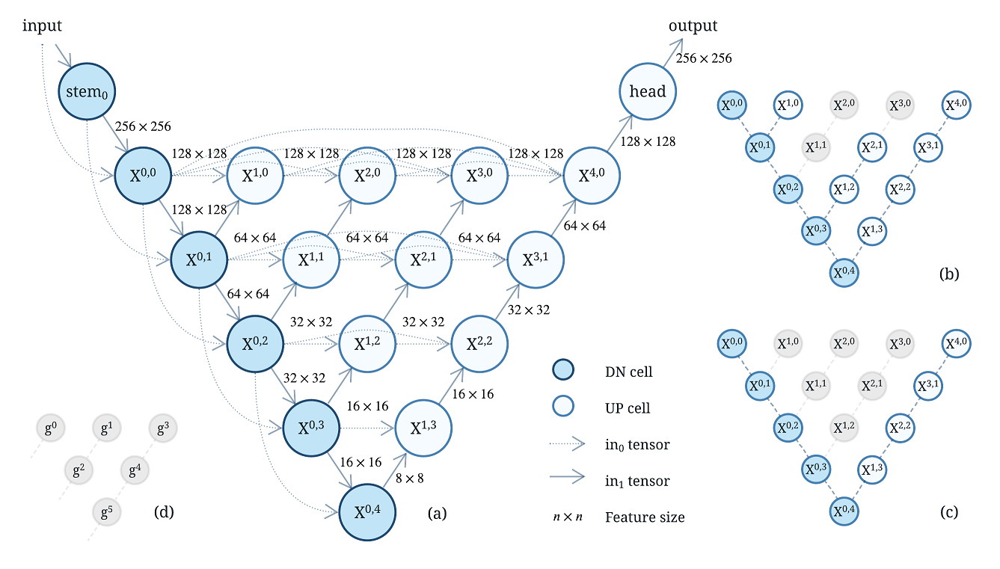
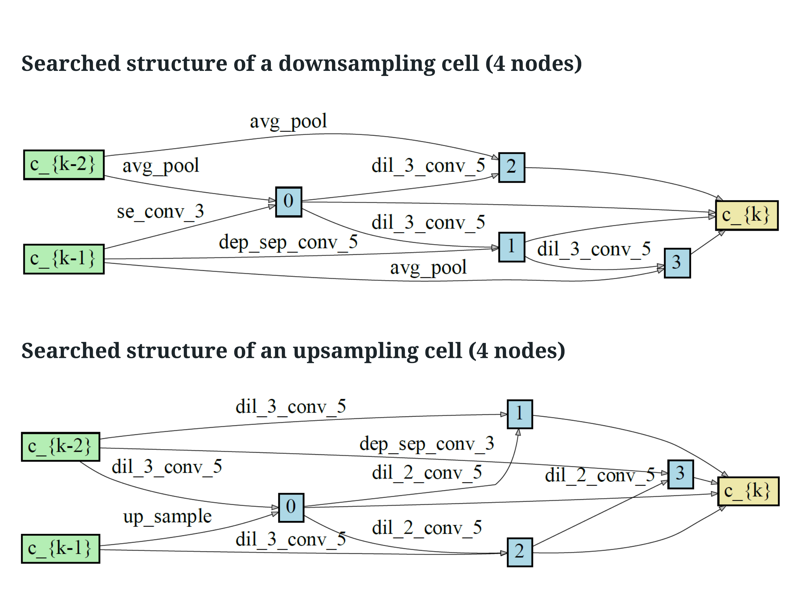
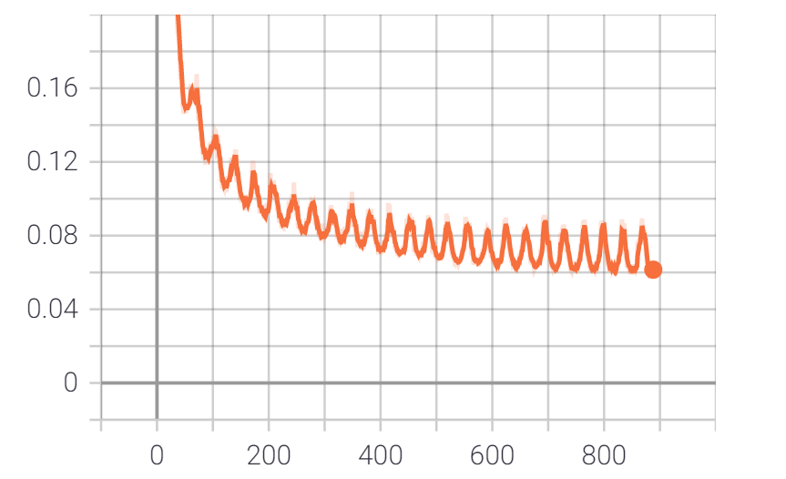
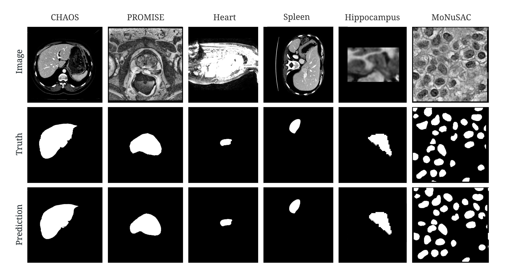
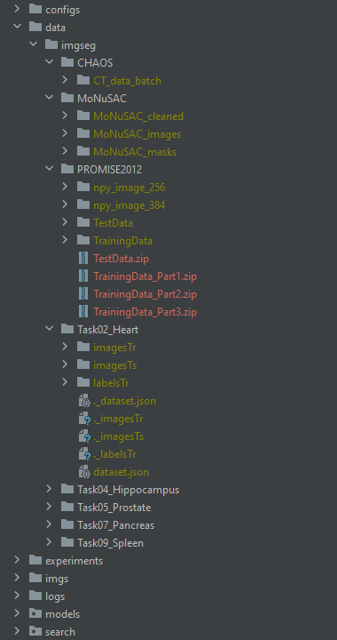

## SENAS: Shrink and Expand Neural Architecture Search for Medical Image Segmentation





## Requirement
See requirements.txt for more details.

```bash
pip3 install -r requirements.txt
conda install --file requirements.txt
```

## Search the architecture

```bash
cd experiments

python ./search_arc.py --config ../configs/senas/senas_promise12.yml
```

### Searched genotype examples and visualization



+ visualization: update the genotype in "tools/cell_visualize.py" and then run the commands below
```bash
cd tools

python ./cell_visualize.py
```

## Train from scratch

+ train with a built-in genotype:
```bash
python ./train_model.py --config ../configs/senas/senas_promise12.yml --model senas
```

+ train with a searched genotype:

```bash
python ./train_model.py --config ../configs/senas/senas_promise12.yml --model senas --genotype "Genotype(down=[('se_conv_3', 1), ('avg_pool', 0), ('dil_3_conv_5', 2), ('dep_sep_conv_5', 1), ('dil_3_conv_5', 2), ('avg_pool', 0), ('avg_pool', 1), ('dil_3_conv_5', 3)], down_concat=range(2, 6), up=[('up_sample', 1), ('dil_3_conv_5', 0), ('dil_3_conv_5', 0), ('dil_2_conv_5', 2), ('dil_3_conv_5', 1), ('dil_2_conv_5', 2), ('dep_sep_conv_3', 0), ('dil_2_conv_5', 4)], up_concat=range(2, 6), gamma=[0, 0, 0, 1, 1, 1])"
```

+ loss visualization with TensorBoard:

```bash
tensorboard --logdir 'C:\Users\xxx\senas\logs\senas\train\promise12\20210930-193026-202268\tbx_log'
```



+ train with other baseline models:
```bash
python ./train_model.py --config ../configs/senas/senas_promise12.yml --model unet
python ./train_model.py --config ../configs/senas/senas_promise12.yml --model unet_plus_plus
python ./train_model.py --config ../configs/senas/senas_promise12.yml --model manet
python ./train_model.py --config ../configs/senas/senas_promise12.yml --model deeplab_v3_plus
python ./train_model.py --config ../configs/senas/senas_promise12.yml --model fpn
python ./train_model.py --config ../configs/senas/senas_promise12.yml --model pspnet
python ./train_model.py --config ../configs/senas/senas_promise12.yml --model pan
python ./train_model.py --config ../configs/senas/senas_promise12.yml --model linknet
python ./train_model.py --config ../configs/senas/senas_promise12.yml --model nasunet
```

+ train with different datasets:
```bash
python ./train_model.py --config ../configs/senas/senas_chaos.yml --model senas
python ./train_model.py --config ../configs/senas/senas_promise12.yml --model senas
python ./train_model.py --config ../configs/senas/senas_monusac.yml --model senas
python ./train_model.py --config ../configs/senas/senas_heart.yml --model senas
python ./train_model.py --config ../configs/senas/senas_spleen.yml --model senas
python ./train_model.py --config ../configs/senas/senas_hippo.yml --model senas
```

### Custom configurations for different datasets

+ There are many hyper parameters that can be adjusted and configured, please refer to those yml files for more details.
+ edit configs/senas/*.yml


## Segmentation results



## Source of data

+ download the data files:

+ CHAOS:
+ https://chaos.grand-challenge.org/Download/
+ https://zenodo.org/record/3431873#.Yi6AP_7P2Uk

+ PROMISE:
+ https://promise12.grand-challenge.org/Download/

+ MoNuSAC:
+ https://monusac-2020.grand-challenge.org/Data/
+ https://github.com/ruchikaverma-iitg/MoNuSAC

+ Medical Segmentation Decathlon (Heart, Spleen, Hippocampus):
+ http://medicaldecathlon.com/
+ https://goo.gl/QzVZcm


+ unzip files into the path shown below



## Related work

+ We acknowledge qubvel for providing re-implemented baseline models: [Segmentation models](https://github.com/qubvel/segmentation_models.pytorch)

+ [PC-DARTS: Partial Channel Connections for Memory-Efficient Architecture Search](https://github.com/yuhuixu1993/PC-DARTS)

+ [NAS-Unet: Neural Architecture Search for Medical Image Segmentation](https://github.com/tianbaochou/NasUnet)

+ The skeleton of our code is referenced from NasUnet, we fixed several issues and re-implemented most of them.


## Citation

If you use this code in your research, please cite our paper.


