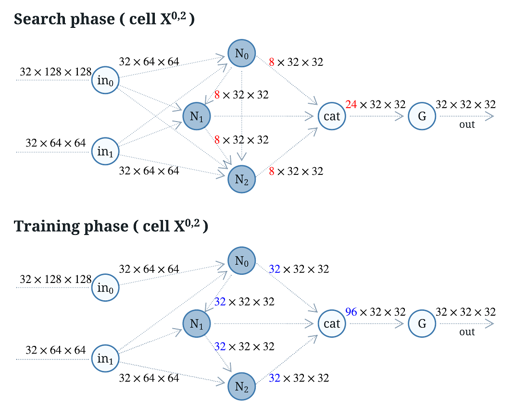

## SENAS: Shrink and Expand Neural Architecture Search for Medical Image Segmentation


## Overview


## Cell


## Node


## Requirement
See requirements.txt for more details.

```bash
pip3 install -r requirements.txt
conda install --file requirements.txt
```

### Search the architecture

```bash
cd experiments

python ./search_arc.py --config ../configs/senas/senas_promise12.yml
```

## Searched genotype examples and visualization


+ visualization: update the genotype in "tools/cell_visualize.py" and then run the commands below
```bash
cd tools

python ./cell_visualize.py
```

### Train from scratch

+ train with a built-in genotype:
```bash
python ./train_model.py --config ../configs/senas/senas_promise12.yml --model senas
```

+ train with a searched genotype:

```bash
python ./train_model.py --config ../configs/senas/senas_promise12.yml --model senas --genotype "Genotype(down=[('se_conv_3', 1), ('avg_pool', 0), ('dil_3_conv_5', 2), ('dep_sep_conv_5', 1), ('dil_3_conv_5', 2), ('avg_pool', 0), ('avg_pool', 1), ('dil_3_conv_5', 3)], down_concat=range(2, 6), up=[('up_sample', 1), ('dil_3_conv_5', 0), ('dil_3_conv_5', 0), ('dil_2_conv_5', 2), ('dil_3_conv_5', 1), ('dil_2_conv_5', 2), ('dep_sep_conv_3', 0), ('dil_2_conv_5', 4)], up_concat=range(2, 6), gamma=[0, 0, 0, 1, 1, 1])"
```

+ loss visualization with TensorBoard:

```bash
tensorboard --logdir 'C:\Users\xxx\senas\logs\senas\train\promise12\20210930-193026-202268\tbx_log'
```


### Custom configurations for different datasets

**edit configs/senas/*.yml**


### Source of data

**Download the data file from the data source website and unzip it to the path shown below**


## Citation

If you use this code in your research, please cite our paper.


